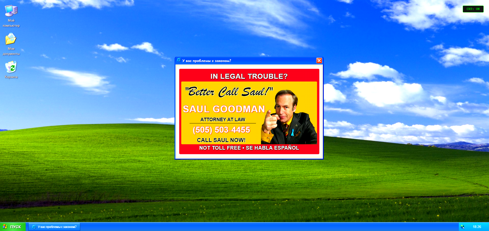

# 🖥️ Windows XP Визитка

Мой персональный сайт-визитка, стилизованный под Windows XP с использованием XP.css.  
Развернут на Vercel: [Открыть сайт](https://xp-portfolio-ajcx.vercel.app/)



## 🛠 Технологии
- ⚛️ React
- 📘 TypeScript
- 🎨 [XP.css](https://botoxparty.github.io/XP.css/) (эмуляция Windows XP UI)
- Иконки: Windows XP

## 📂 Функционал
### Системные иконки:
- **🖥️ Мой компьютер** → Раздел "Обо мне"
- **📁 Мои документы** → Мои проекты
- **🗑 Корзина** → Шуточные файлы и пасхалки

### Дополнительные фичи:
- Периодически всплывающие рекламные баннеры (в стиле 2000-х)
- Кнопка для отключения CRT-эффекта (эмуляция старого монитора)
- Аутентичный интерфейс Windows XP с окнами, меню "Пуск" и системными звуками

## � Установка и запуск
1. Клонировать репозиторий:
   ```bash
   git clone https://github.com/ваш-username/ваш-репозиторий.git
   
2. Установка и запуск:
   ```bash
      npm install
   
      npm run dev